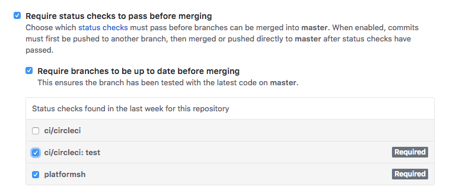
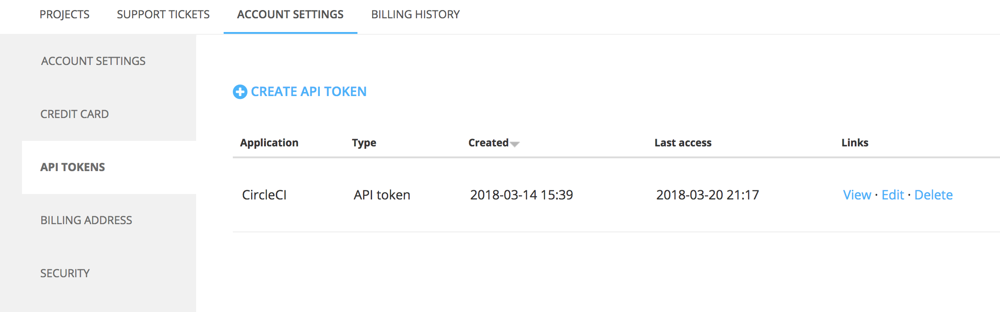

The objective of this article is to explain how to host your [Node.js](https://nodejs.org/en/) app on [Platform.sh](https://platform.sh/) whilst keeping your repository on [GitHub](https://github.com), and having your unit _and_ integration tests executed by [CircleCI](https://circleci.com) for each pull request.

### Development workflow

First things first. In our case study, we have decided to adopt a micro-release workflow model. Let’s first look at the basic organisation of our Git repository:

```
-- master # this is the branch that contains the code deployed to live
|
|____feature-1 # feature-X are feature branches
|____feature-2
.
.
|____feature-N
```

In an ideal world, you want each of those branches mapped to a separate environment, and that’s exactly what Platform.sh allow you to do. We will call these environments _feature environments_. In a micro-release model, the feature environments are, at the same time, _integration environments_ and _stage environments_ for the micro-release that will contain the single feature implemented in the related branch.

In this model, when you branch off `master` and create `feature-x`, you implement one feature, and this is available for use and testing on the related feature environment (here provided by Platform.sh), which will also serve as integration environment that integration tests will use; stage testing will also happen onto the same environment. If all is ok, than the micro-release is ready to go live, and you simply merge `feature-x` into `master`.

### Hosting Node.js apps on Platform.sh

I won’t go in details for this one. It will suffice to point you to the official [Platform.sh Documentation](https://docs.platform.sh/languages/nodejs.html) for setting up a Node.js app.

### GitHub-Platform.sh integration

Again, you can read the [official documentation](https://docs.platform.sh/administration/integrations/github.html#github) for how to set up a GitHub integration on Platform.sh.  
There are different options, and they are all explained in the documentation. If you’re curious about my favourite set-up, it’s the following

```
| fetch_branches                  | true
| build_pull_requests             | true
| build_pull_requests_post_merge  | false
| pull_requests_clone_parent_data | true
```

What this means is that branches are tracked, environments on Platform.sh are built for pull requests only, and every commit pushed up to an open pull request will cause such environments to rebuild. Also, each feature environment is created cloning data from the parent (in the case of the model presented here, the parent is always the live environment, or in git terms, the `master` branch).

### GitHub-CircleCI integration

GitHub supports CircleCI out of the box, so all you need is a `.circleci` directory at the root of your repository that contains the CircleCI `config.yml` file. Once again, I’ll leave the actual set up of your project on CircleCI to you; you can sign-up, integrate your GitHub repositories, and start from a [sample configuration](https://circleci.com/docs/sample-config/).

### Mandatory continuous build and test

GitHub allows you to require status checks to pass successfully before allowing you to merge a pull request. You can go to

```
https://github.com/[user|organization]/[repo]/settings/branches/master
```

(because `master` is the branch to protect in our model).

If you have correctly setup integration with Platform.sh and CircleCI, on that page you’ll see something like the following, where you can enable `platformsh` and `circleci` to be a required check.



Now all your pull requests into `master` will have to pass those checks in order to be merged.

### Unit Tests on CircleCI

The pure unit tests are pretty easy to get working. Here’s an example based off my config:

```yaml
version: 2
jobs:
  test:
    docker:
      - image: circleci/node:8.9.3
    environment:
      PLATFORM_VARIABLES: "set this to what you need, if you need"
    steps:
      - checkout
      - run:
          name: Install NodeJS app
          command: npm install
      - run:
          name: Test NodeJS app
          command: npm test
workflows:
  version: 2
  testwork:
    jobs:
      - test
```

Whatever testing framework you use (I use `ava`), if it supports a “watch” mode, make sure you do not use it in this case. The test process must finish in order to get a result back from CircleCI.

### Integration Tests on CircleCI

This was the “tricky” bit for our setup. Our Node.js app is a GraphQL server, and we have decided to unit-test our models, but not the resolvers. Rather, we write integration tests against our API, hitting the API endpoint directly, knowing that this, in turn, will test our resolvers too.

The issue lied in the fact that it is GitHub triggering both the Platform.sh build and the CircleCI one; they run independently and know nothing about each other. Yet, we needed the URL of the Platform.sh environment to be known to the integration tests.

Using Platform.sh API from CircleCI container is the obvious thought, but the [official CLI client](https://github.com/platformsh/platformsh-cli) requires PHP, and the CircleCI’s Node.js docker image does not come with PHP, nor is it possible to install it (at the best of my knowledge; I’ve tried and failed). A first alternative I considered was to use their [JS Client](https://github.com/platformsh/platformsh-client-js) directly from within the tests, but I quickly discarded that for two reasons: first, their JS client is still buggy and unreliable, and second, the logic to grab the URL of the environment should not be in the tests or the app at all. At most, the URL of the integration server should be ready for the tests to fetch from an environment variable living in the container running the tests. And that’s what I settled for.

#### Get a Platform.sh API token

This is the first thing you want to do, and you can do it by going to:

```
https://accounts.platform.sh/user/[user-id]/api-tokens
```

There you’ll see something like this:



Create a new token, give it a name you like, copy it, and save it. Then head over to

```
https://circleci.com/gh/[github-user|github-organization]/[github-project]/edit#env-vars
```

and add an environment variable `PLATFORMSH_API_TOKEN` and assign the Platform.sh API token to it.

#### Getting the URL for the integration environment

The crucial part was to get the URL for the environment that will serve as integration server, namely the feature environment. Making things worse was the fact that Platform.sh do not have their API documented, so I had to do a bit of digging before I could figure out how to authenticate and get the information I needed via the API. I got there in the end.

```shell
#!/usr/bin/env bash

# Authorization URL.
PLATFORMSH_AUTH_URL="https://accounts.platform.sh/oauth2/token"
# IMPORTANT: replacing printf with echo will noy yield the same (correct) result
PLATFORMSH_CLIENT_ID=$(printf "platform-cli:" | base64)
# PLATFORM_API_TOKEN variable is set in the Environment Variables section of the project's settings on CircleCI
PLATFORMSH_ACCESS_TOKEN=$(curl -s "${PLATFORMSH_AUTH_URL}" -H "Authorization: Basic ${PLATFORMSH_CLIENT_ID}" -H 'Content-Type: application/json' -X POST -d "{\"grant_type\": \"api_token\", \"api_token\": \"$PLATFORMSH_API_TOKEN\"}" | jq -r ".access_token")
# The env's machine name on platform.sh is pr-<github-pr-number>. 
# CI_PULL_REQUEST is set by CircleCI during the environment set up for the container. 
PLATFORMSH_PR_ENV="pr-$(echo ${CI_PULL_REQUEST} | grep / | cut -d/ -f7-)"
# Platform.sh region.
PLATFORMSH_REGION="eu"
# The project ID on platform.sh
PLATFORMSH_PROJECT="trxpe5o7zxsif"
# getEnvironment() API endpoint.
PLATFORMSH_API_URL="https://${PLATFORMSH_REGION}.platform.sh/api/projects/${PLATFORMSH_PROJECT}/environments/${PLATFORMSH_PR_ENV}"

# The platform.sh environment may not yet be ready when CircleCI runs this script.
# So, we enter a polling loop with a cycle of ${SLEEP_TIME} seconds.
# Since this script is only run when CircleCI is triggered by a pull request on our repo,
# and since the same pull request also triggers the creation of an environment,
# it is safe to assume that under normal conditions this loop will eventually terminate.
# If for any reason this should not be the case, CircleCI will eventually kill the process.
SLEEP_TIME="60" # in seconds
ENV_CMD="curl -s ${PLATFORMSH_API_URL} -H 'Authorization: Bearer '${PLATFORMSH_ACCESS_TOKEN}"
ENV_INFO=$(eval ${ENV_CMD})
ENV_STATUS=$(echo ${ENV_INFO} | jq -r '.status')
while [ "${ENV_STATUS}" != "active" ]; do
  sleep ${SLEEP_TIME}
  ENV_INFO=$(eval ${ENV_CMD})
  ENV_STATUS=$(echo ${ENV_INFO} | jq -r '.status')
done

# Fetching pf:routes as we host in multi-app. Check what the API returns for a single-app deployment, I have the feeling it's something like public_url.
echo $(echo $ENV_INFO | jq -r '.["_links"]["pf:routes"]' | grep -Eo 'https:\/\/.*\/graphql')
```

This `bash` script above essentially deals with Platform.sh API and gets the URL we require.  
You can place this at `.circleci/integration-url.sh` just as I did (do not forget to make the script executable by a `chmod 755`). Next, your `config.yaml` will need some tweaking.

```yaml
version: 2
jobs:
  test:
    docker:
      - image: circleci/node:8.9.3
    environment:
      PLATFORM_VARIABLES: "set this to what you need, if you need"
    steps:
      # Dependecies.
      - run:
          name: Install JQ
          # jq is required by the integration-url.sh script.
          command: sudo apt-get install jq
      # Checkout and Test.
      - checkout
      - run:
          name: Install NodeJS app
          command: npm install
      - run:
          name: Test NodeJS app
          # We set this env variable to be available for the tests to pick up.
          command: INTEGRATION_ENV_URL=$(.circleci/integration-url.sh) npm test
workflows:
  version: 2
  testwork:
    jobs:
      - test
```

With that, all you need to do from your Node.js app tests is to access `process.env.INTEGRATION_ENV_URL`.
