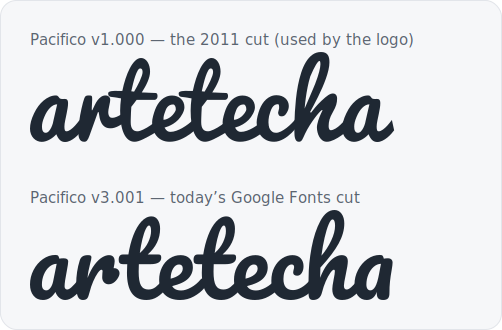

When I [moved this site off WordPress](/writing/wordpress-to-astro-in-a-day/)
a few days ago, one thing nagged at me afterwards. The whole site was now
crisp vector and text — except the logo, which was still a PNG I'd pulled
off the old site: `logo-retina.png`, 542×148, a fixed grid of pixels from
2016.

On a static site with a dark mode, a raster logo is a small, persistent
embarrassment. It can't recolour, so supporting dark mode meant shipping a
*second* PNG with the blue script manually lightened — a file I'd generated
by walking the pixels and nudging the hue, which is exactly the kind of
hack you notice every time you open the assets folder. It's soft on
high-density screens beyond its 2× size. And it's opaque to the one thing
this site is otherwise made of: text you can read, diff, and change.

So the logo became the migration's last chore. Here's how it went from a
raster to a single, theme-aware SVG — and the two false starts on the way.

## It's a font

The Artetecha wordmark is a bouncy blue script. Looking at it with fresh
eyes, the letterforms were suspiciously even — the two `t`s identical, the
terminals consistent, the bounce regular. That's not hand-lettering; that's
a typeface.

The quickest way to test a hunch like this is to overlay the wordmark on
likely candidates at matched size. I set "artetecha" in a handful of Google
script fonts and lined them up against the PNG. One was an instant,
glyph-for-glyph match: **Pacifico**. Given the logo dates from 2012, when
Pacifico was the free script font of the moment, I'd bet money it was the
original. This wasn't "a font that gets close" — it was almost certainly
the source. A vector rebuild would carry zero brand drift.

Or so I thought.

## The wrong Pacifico

I grabbed Pacifico from Google Fonts, outlined "artetecha", and it was…
off. Heavier. More upright. The jaunty forward lean of the original had
been sanded down. Close enough that most people wouldn't clock it, wrong
enough that I would, every day.

The culprit is that Pacifico has been redrawn. The version Google Fonts
serves today is **v3.001**; the 2011 release — the one a 2012 logo would
have used — is **v1.000**, and Vernon Adams's original has a noticeably
lighter weight and a stronger slant. Set the same word in both and the drift
is obvious:



The fix was to stop using the current cut. Font Squirrel still distributes
the original v1.000, under the same [SIL Open Font
License](https://openfontlicense.org/) — which, helpfully, explicitly
permits outlining glyphs into a logo with no attribution required in the
artwork itself. I noted the provenance in an SVG comment anyway, because
future me will want to know.

There was one more transform to recover. Laid over the PNG, even the right
cut sat too narrow: the original designer had stretched the type
horizontally, by about 1.39×. A quick non-uniform scale on the outlined
path — wider than it is tall — and the wordmark finally dropped onto the
original exactly.

## Tracing three blobs

The wordmark was only ever the easy half. To its left sit three
overlapping blobs — a grey pebble, a lime one, an amber one — and they are
not geometric. My first instinct had been to approximate them with rounded
rectangles (the same squircles I'd used for the favicon), rotated to fake
the organic tilt. Up close, they read as what they were: rectangles
pretending to be pebbles.

The blobs are original artwork, so the honest thing was to trace the actual
shapes rather than reinvent them. I recovered the original retina PNG from
git history, classified each pixel by colour into three masks, and for each
blob walked outward from its centre at fixed angular steps, recording where
the ink ended — a radial trace. A light pass of smoothing, then converting
the sampled points into a closed Catmull-Rom curve, gave three
smooth-but-irregular outlines that match the pebbles instead of
impersonating them.

## The tooling detour

The first attempt to outline the text produced a logo that rendered as
"arte" and then stopped dead. The path data was full of `NaN`s: the library
I reached for first choked on the font's curve commands and silently
emitted garbage coordinates, and an SVG parser gives up at the first one.
Swapping to [fontkit](https://github.com/foliojs/fontkit) — which shapes
the text properly, kerning and all — produced clean path data on the first
run. Ten minutes lost to a library that failed quietly instead of loudly;
the usual tax.

## One file, both themes

The finished logo is a single SVG: the three traced blobs in their brand
colours, and "artetecha" as outlined paths, composed in the same 542×148
coordinate space as the original so every proportion carries over. It lives
in the repo as [a small Astro component](https://github.com/artetecha/artetechacom),
and there's a standalone copy at [/logo.svg](/logo.svg).

The part that finally retired the dark-mode hack: the script's fill is a CSS
custom property.

```svg
<g fill="var(--logo-script, #1c6398)"> … </g>
```

Steel blue in the light theme, a lighter steel in the dark — one variable,
flipped by the same mechanism that themes the rest of the site. The blobs
keep their colours in both. No second PNG. No recolouring script. About six
kilobytes instead of two raster files, crisp at any size, and legible as
plain text in a diff.

Which is the whole point. After the migration, the site was a folder of
files you could read. Now the logo is too.
