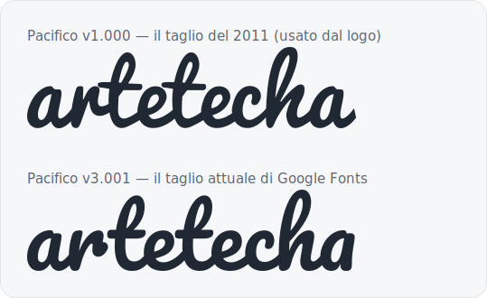

Quando qualche giorno fa ho [spostato questo sito da
WordPress](/writing/wordpress-to-astro-in-a-day/), una cosa ha continuato a
darmi fastidio. Tutto il sito era ormai vettore e testo nitido — tranne il
logo, ancora un PNG che avevo recuperato dal vecchio sito:
`logo-retina.png`, 542×148, una griglia fissa di pixel del 2016.

Su un sito statico con tema scuro, un logo raster è un piccolo, persistente
imbarazzo. Non può cambiare colore, quindi supportare il tema scuro voleva
dire spedire un *secondo* PNG con lo script blu schiarito a mano — un file
che avevo generato scorrendo i pixel e ritoccando la tinta, esattamente il
tipo di trucco che noti ogni volta che apri la cartella degli asset. È
morbido sugli schermi ad alta densità oltre la sua dimensione 2×. Ed è opaco
all’unica cosa di cui questo sito è per il resto fatto: testo che puoi
leggere, confrontare e modificare.

Così il logo è diventato l’ultima incombenza della migrazione. Ecco come è
passato da raster a un unico SVG consapevole del tema — e le due false
partenze lungo la strada.

## È un font

Il wordmark di Artetecha è uno script blu spensierato. Guardandolo con occhi
nuovi, le forme delle lettere erano sospettosamente regolari — le due `t`
identiche, i terminali coerenti, il rimbalzo costante. Non è lettering a
mano; è un carattere tipografico.

Il modo più rapido di verificare un’intuizione così è sovrapporre il
wordmark ai candidati probabili, alla stessa dimensione. Ho composto
“artetecha” in una manciata di font script di Google e li ho allineati con
il PNG. Uno era una corrispondenza istantanea, glifo per glifo:
**Pacifico**. Dato che il logo risale al 2012, quando Pacifico era il font
script gratuito del momento, ci scommetterei che fosse l’originale. Non era
“un font che ci va vicino” — era quasi certamente la fonte. Una ricostruzione
vettoriale non avrebbe portato alcuna deriva di brand.

O almeno così credevo.

## Il Pacifico sbagliato

Ho preso Pacifico da Google Fonts, ho trasformato “artetecha” in tracciati,
ed era… sbagliato. Più pesante. Più dritto. La spavalda inclinazione in
avanti dell’originale era stata levigata via. Abbastanza vicino da non far
notare nulla ai più, abbastanza sbagliato da darmi fastidio, ogni giorno.

Il colpevole è che Pacifico è stato ridisegnato. La versione che Google
Fonts serve oggi è la **v3.001**; il rilascio del 2011 — quello che un logo
del 2012 avrebbe usato — è la **v1.000**, e l’originale di Vernon Adams ha un
peso nettamente più leggero e un’inclinazione più marcata. Componi la stessa
parola in entrambi e la differenza è evidente:



La soluzione è stata smettere di usare il taglio attuale. Font Squirrel
distribuisce ancora la v1.000 originale, sotto la stessa [licenza SIL Open
Font](https://openfontlicense.org/) — che, comodamente, permette
esplicitamente di trasformare i glifi in tracciati per un logo senza alcuna
attribuzione richiesta nell’artwork stesso. Ho comunque annotato la
provenienza in un commento dell’SVG, perché il me del futuro vorrà saperlo.

Restava un’ultima trasformazione da recuperare. Sovrapposto al PNG, persino
il taglio giusto risultava troppo stretto: il designer originale aveva
allungato il carattere in orizzontale, di circa 1,39×. Una rapida scala non
uniforme sul tracciato — più largo che alto — e il wordmark è finalmente
caduto sull’originale con precisione.

## Tracciare tre blob

Il wordmark è sempre stato solo la metà facile. Alla sua sinistra ci sono
tre blob sovrapposti — un ciottolo grigio, uno lime, uno ambra — e non sono
geometrici. Il mio primo istinto era stato approssimarli con rettangoli
arrotondati (gli stessi squircle che avevo usato per la favicon), ruotati
per simulare l’inclinazione organica. Da vicino, si leggevano per quello che
erano: rettangoli che fingevano di essere ciottoli.

I blob sono artwork originale, quindi la cosa onesta era tracciare le forme
reali invece di reinventarle. Ho recuperato il PNG retina originale dalla
cronologia git, ho classificato ogni pixel per colore in tre maschere e, per
ogni blob, ho camminato verso l’esterno dal suo centro a passi angolari
fissi, registrando dove finiva l’inchiostro — un tracciamento radiale. Una
leggera passata di smoothing, poi la conversione dei punti campionati in una
curva di Catmull-Rom chiusa, ha dato tre contorni morbidi-ma-irregolari che
combaciano con i ciottoli invece di impersonarli.

## La deviazione degli strumenti

Il primo tentativo di trasformare il testo in tracciati ha prodotto un logo
che si fermava a “arte”. I dati del tracciato erano pieni di `NaN`: la
libreria a cui avevo pensato per prima si è ingolfata sui comandi di curva
del font ed ha emesso in silenzio coordinate spazzatura, e un parser SVG si
arrende al primo. Passare a [fontkit](https://github.com/foliojs/fontkit) —
che compone il testo come si deve, kerning incluso — ha prodotto tracciati
puliti al primo colpo. Dieci minuti persi per una libreria che ha fallito in
silenzio invece che ad alta voce; la solita tassa.

## Un file, entrambi i temi

Il logo finito è un unico SVG: i tre blob tracciati nei loro colori di
brand, e “artetecha” come tracciati, composti nello stesso spazio di
coordinate 542×148 dell’originale così che ogni proporzione si conservi. Vive
nel repository come [un piccolo componente
Astro](https://github.com/artetecha/artetechacom), e c’è una copia autonoma
su [/logo.svg](/logo.svg).

La parte che ha finalmente mandato in pensione il trucco del tema scuro: il
riempimento dello script è una custom property CSS.

```svg
<g fill="var(--logo-script, #1c6398)"> … </g>
```

Blu acciaio nel tema chiaro, un acciaio più chiaro nello scuro — una sola
variabile, ribaltata dallo stesso meccanismo che dà il tema al resto del
sito. I blob mantengono i loro colori in entrambi. Nessun secondo PNG.
Nessuno script per ricolorare. Circa sei kilobyte al posto di due file
raster, nitido a qualsiasi dimensione, e leggibile come testo semplice in un
diff.

Ed è tutto qui il punto. Dopo la migrazione, il sito era una cartella di file
che potevi leggere. Ora lo è anche il logo.
